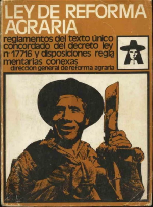

# Reforma agraria

**Recuperando una antigua tradición latinoamericana, en un lejano país al que hoy, con el perdón de nuestros ancestros y próceres de la independencia, podríamos denominar "graboisland" se ha decidido redistribuir el uso de la tierra y reglamentar la producción, de manera de generar lotes del tamaño apropiado para garantizar el sustento de una familia y acorde al tipo de cultivo que se desarrolle. 
Ya no tiene sentido diferenciar campesinos y campesinos de terratenientes, cerramos la grieta y son simplemente productores agropecuarios que trabajan en su tierra.** 

### Producción suficiente

Cada lote genera ingresos que se calculan como la cantidad de hectáreas que trabaja por el rendimiento anual que obtiene de cada una de ellas. Por ejemplo, un lote de 10 hectáreas con un rendimiento de 500 grabopesos cada una, da un ingreso anual de 5000. 
Además, se sabe cuál es el costo de vida mensual en el país para una familia tipo.

**Averiguar qué porcentaje de lotes genera un ingreso suficiente** con el que llega a cubrir el costo de vida de la familia durante un año.

### Regulación de cultivos

Existen variados cultivos que se pueden producir en los lotes y en principio cada uno se dedica a un cultivo en particular en toda su superficie en una campaña, aunque al año siguiente se puede cambiar. 
El gobierno fija un máximo de cantidad de hectáreas que se pueden cultivar en cada unidad productiva (actualmente 50), y establece ciertas regulaciones según qué cultivo se trata, por ejemplo para evitar un desgaste excesivo del suelo. De esta manera, para cada cultivo se establece un índice de intensidad en el uso del suelo, que normalmente es 1, pero en algunos casos puede ser mayor. Este valor limita la superficie del lote que realmente puede utilizarse productivamente.
Por ejemplo, el maíz y el sorgo tienen índice 1, pero en cambio la soja tiene índice 2.  

**Averiguar si un lote se está excediendo en el uso del suelo**, lo cual ocurre cuando la cantidad de hectáreas productivas que posee supera las permitidas, teniendo en cuenta que la superficie permitida es la que indica la ley, pero afectadas de manera inversamente proporcional por el índice de intensidad del cultivo. Por ejemplo, de maíz puede tener hasta 50 hectáreas, pero de soja sólo puede llegar a la mitad, es decir 25 ha. (se rumorea que se va a establecer en 50 el índice de intensidad del cannabis, para que el máximo permitido sea de una hectárea) 

### Más cultivos

Algunos cultivos son genéricos: los valores que establecen no se fijan individualmente para ellos, sino por el ente regulador del sector. Por ejemplo, los cultivos de limón, naranja y pomelo, están regulados por la cámara de cítricos, que establece las mismas condiciones para todos.

Otros cultivos son en realidad una combinación de cultivos que se producen en el mismo lote. Por ejemplo, hay productores frutícolas de manzanas y peras, otros que combinan yerba mate con distintas variedades de té. En este caso, los valores de la regulación se establecen como el promedio de los valores de regulación de cada producto.

**Hacer un aumento de productividad generalizado**, que implica incrementar en un porcentaje dado los rendimientos de todos los lotes que no tienen producción suficiente y que no se exceden en el uso del suelo. 

### Iniciativas

Los sectores que conforman la sociedad graboislandesa sigue discutiendo y ejerciendo presión para lograr sus intereses, por lo que hay diferentes iniciativas tendientes a modificar la situación actual. Concretamente, cada iniciativa incluye una serie de propuestas de cambio del marco regulatorio. Si la iniciativa tiene éxito, las propuestas se concretan. Las propuestas conocidas son: 
- Duplicar la productividad
- Reducir o aumentar las hectáreas de cada lote en un porcentaje, pero manteniendo el ingreso total.
- Que los productores de cierto cultivo lo cambien por otro. 

Cada iniciativa se lleva adelante con una diferente modalidad y esa puede ser la clave del éxito:
- Un tractorazo es exitoso si participan al menos 10000 personas y si en el país hay menos policías activos que participantes.
- Un proyecto de ley es exitoso con que se sumen 100 personas, siempre y cuando la avale un partido político mayoritario.
- Una iniciativa virtual es exitosa si se suman al menos 1000 personas, y la cantidad de likes supera ampliamente la de trolls (5 a 1 como mínimo)

**Saber si una iniciativa va a ser exitosa**

**Hacer que una iniciativa tenga los efectos correspondientes** en caso de ser exitosa.

**Inventar una nueva iniciativa**

**Se pide resolver los requerimientos planteados y hacer algunos tests significativos.**

---------------------

*Cuando vemos a nuestros labradores en la mayor parte llenos de miseria e infelicidad, que una triste choza apenas les liberta de las intemperies; que en ellas moran padres e hijos; que la desnudez está representada en toda su extensión, no podemos menos que fijar el pensamiento para indagar las causas de tan deplorable desdicha. […] Todos esos males son causas de la principal, que es la falta de propiedades de los terrenos que ocupan los labradores: este es el gran mal de donde provienen todas sus infelicidades y miserias, y de que sea la clase más desdichada de estas provincias…*

*Sí; la falta de propiedad trae consigo el abandono, trae la aversión a todo trabajo; porque el que no puede llamar suyo a lo que posee que en consecuencia no puede disponer […]; el que no puede consolarse de que al cerrar los ojos deja un establecimiento fijo a su amada familia, mira con tedio el lugar ajeno, que la indispensable necesidad le hace buscar para vivir… […]*

*Se deja ver cuán importante sería que se obligase a estos, no a darlas en arrendamiento, sino en enfiteusis a los labradores, […] para que se apegasen a ellas, y trabajasen como en cosa propia, que sabían sería el sostén de su familia por una muy moderada pensión; y seguramente muy pronto por este medio nos presentaría el campo, que nos rodea, una nueva perspectiva, subrogando este medio justo a la propiedad.*

*Pero todavía hay más; se podría obligar a la venta de los terrenos que no se cultivan al menos en una mitad, si en un tiempo dado no se hacían plantaciones por los propietarios; y mucho más se les debería obligar a los que tienen sus tierras enteramente desocupadas, y están colinderas con nuestras poblaciones de campaña… […]*

***Manuel Belgrano*** 

Correo de Comercio, Nº 17, 23 de junio de 1810, en Correo de Comercio, Tomo I, Buenos Aires, Real imprenta de niños expósitos, 1810, págs. 130-136.

Nota completa en https://www.elhistoriador.com.ar/manuel-belgrano-y-la-distribucion-de-la-tierra/

